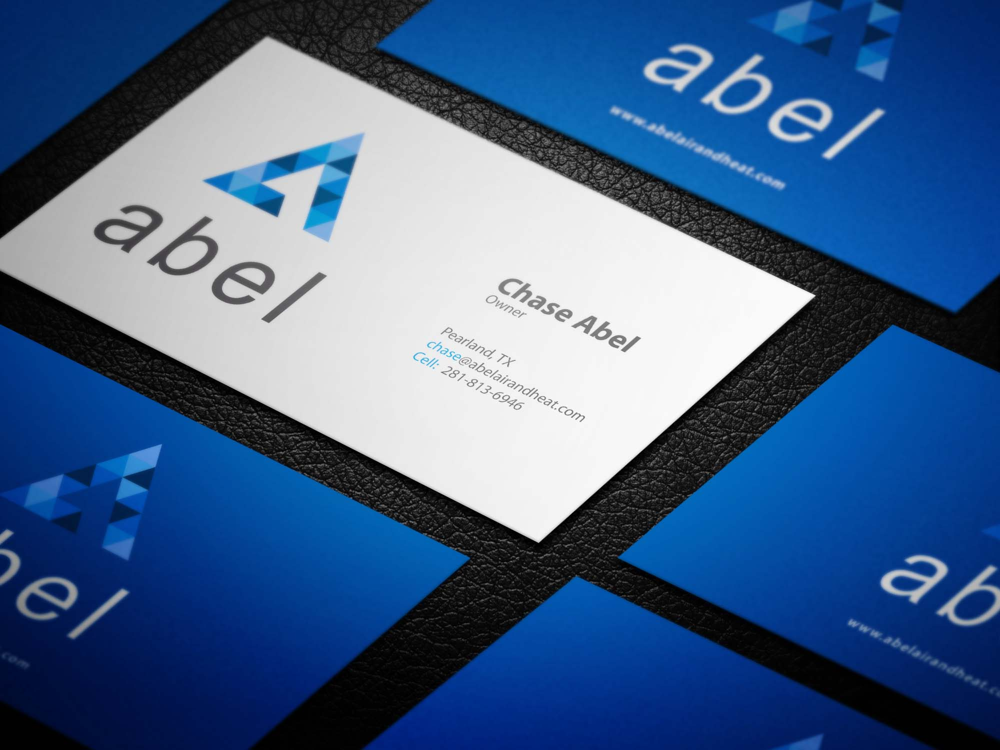
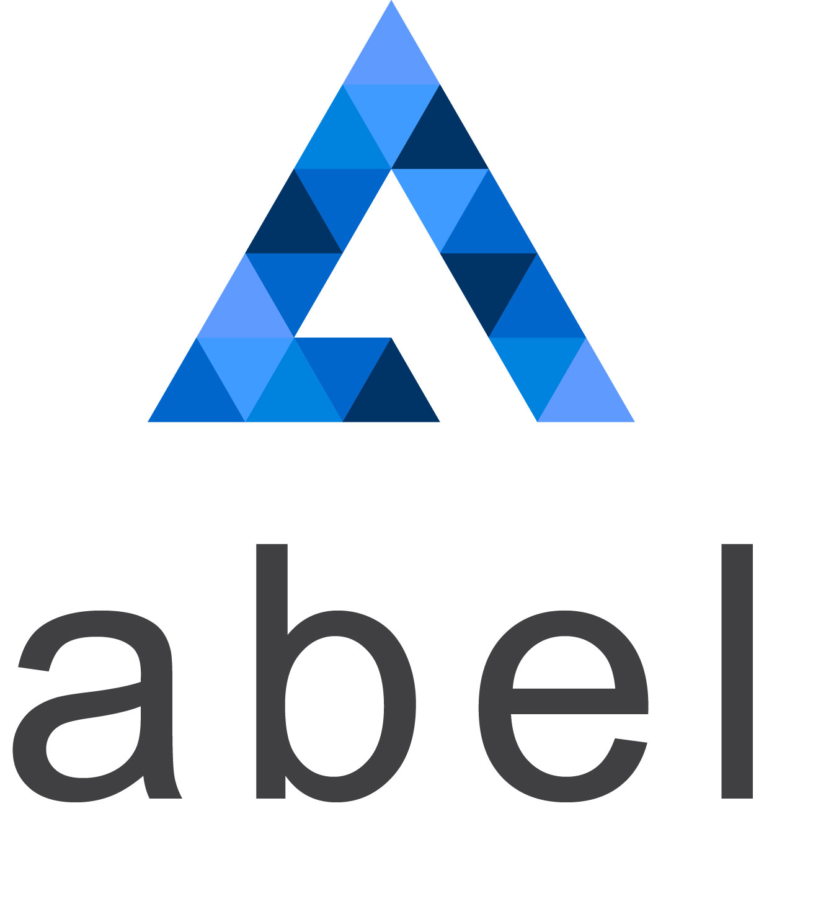

---
# front matter tells Jekyll to process Liquid
layout: default
title:
permalink: /abel-air-and-heat
---

  

    

      <h1 class="company-name">Abel Air & Heat</h1> 
    

    

      
Abel Air & Heat is a heating, ventilation, and air conditioning company based in Pearland, TX. They needed a complete rebranding, including logo, website, and marketing materials

    

  

  

    

      
    

  

  

    

      <h3>Approach</h3> 
    

    

      
My focus for the logo was future flexibility since the client told me they would probably branch off into other business areas in the future related to HVAC.

    

  

  

    

      
    

  

