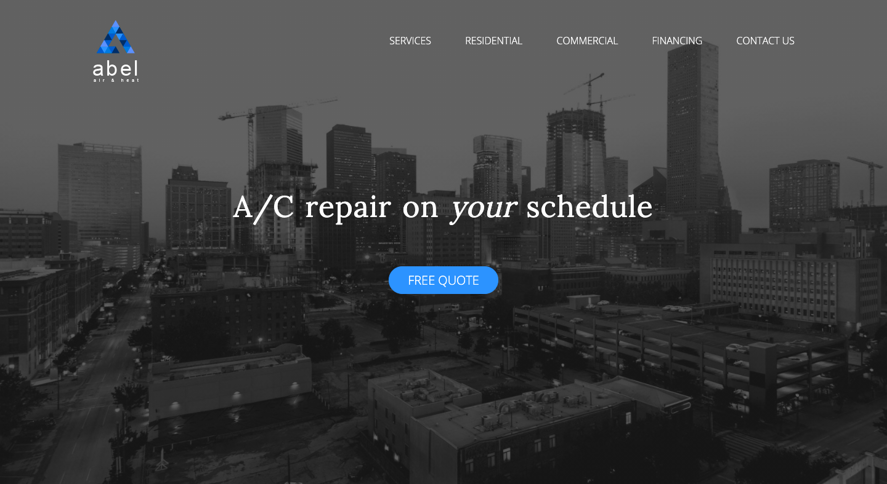

---
# front matter tells Jekyll to process Liquid
layout: default
title:
permalink: /abel-air-and-heat
---

  

    

      <h1 class="company-name">Abel Air & Heat</h1> 
    

    

      
Abel Air & Heat is a heating, ventilation, and air conditioning company based in Pearland, TX. They needed a complete rebranding, including logo, website, and marketing materials.

    

  

  

    

      
    

  

  

    

      <h3>Approach</h3> 
    

    

      
For this brand, I focused on trying to create a simple, clean logo and identity with the use of blue contrasted by shades of gray. I also decided to build a single-page website, including information about the services offered by the company and a contact form to request service. The site was built completely from scratch in plain old HTML, CSS, JavaScript, and a little PHP. I usually prefer to build simple websites this way because the pages load quickly, which is a good defense against a high bounce rate. 

    

  

<!--
  

  

  

    

      
#053466

    

    

      
#5F99FB

    

  

-->

  

    

      
    

  

  

    

      <h3>Result</h3> 
    

    

      
The result was a super clean logo made of varying shades of blue triangles in the shape of the letter “A”. It was also beneficial that the logo resembled a house. I eventually included the words “Air & Heat” under the symbol so it was clear that this is a HVAC company, which could be changed to something else later if the company decided to branch off into other services. As you can see from the images below, the website is designed around the blue and gray color scheme, which really makes the logo and call-to-actions pop. 

    

  

  

    

      
    

  

  

    

      
    

  

  

    

      
    

  

