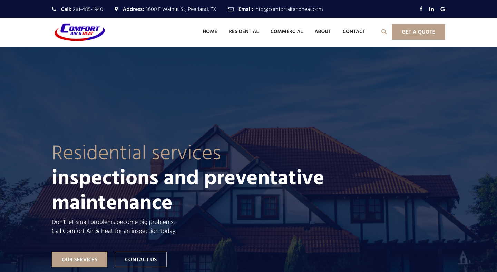
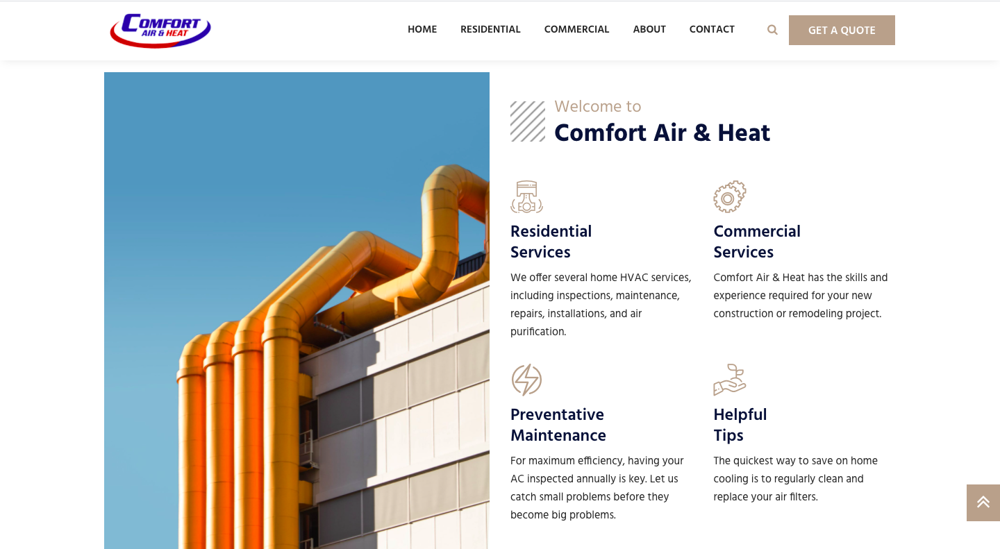
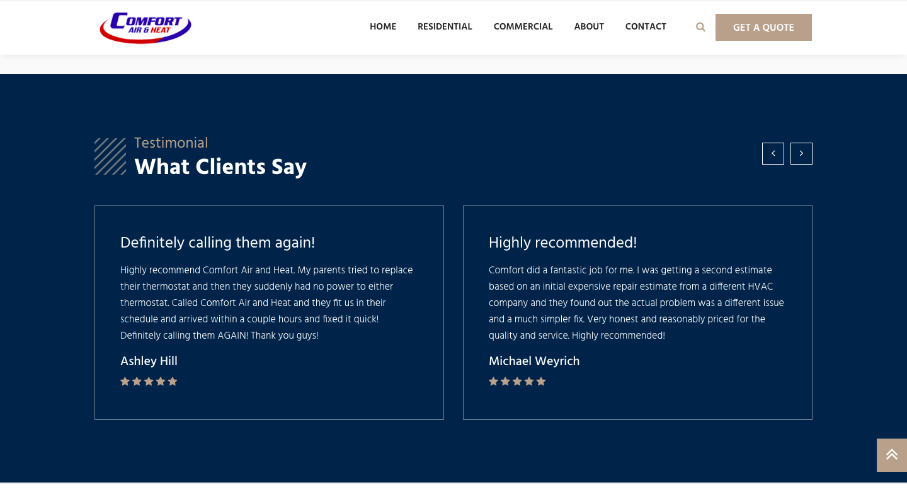

---
# front matter tells Jekyll to process Liquid
layout: default
title:
permalink: /comfort-air-and-heat
---

  

    

      <h1 class="company-name">Comfort Air & Heat</h1> 
    

    

      
<a href="https://www.comfortairandheat.com" target=_blank>Comfort Air & Heat</a> is a heating, ventilation, and air conditioning company based in Pearland, TX. The company needed a website to display their contact information, the services they offer, and to showcase some of the work they’ve done.

    

  

  

    

      
    

  

  

    

      <h3>Approach</h3> 
    

    

      
The client wanted the ability to make small changes to the website, such as adding photos and updating service information, so I chose WordPress for the Content Management System (CMS) so someone could easily make changes without knowing any HTML or CSS.

    

  

  

    

      
    

  

  

    

      <h3>Result</h3> 
    

    

      
After extensive research, I chose the <a href="https://themeforest.net/item/dustrial-factory-industrial-wordpress-theme/23011277" target=_blank>Dustrial</a> WordPress theme by ThemeForest member <a href="https://themeforest.net/user/johanspond" target=_blank>Johanspond</a> as the ideal template for creating the website. It included a lot of features out-of-the-box so there was very little custom HTML or CSS written on my part. The biggest challenge ended up being the overall copy on the site since I know next to nothing about HVAC work. After interviewing the client to learn more about their business and analyzing other HVAC technician sites, I was able to develop original content that fit the brand and the work they provide.

    

  

  

    

      
    

  

