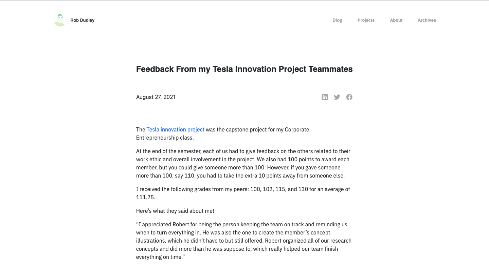
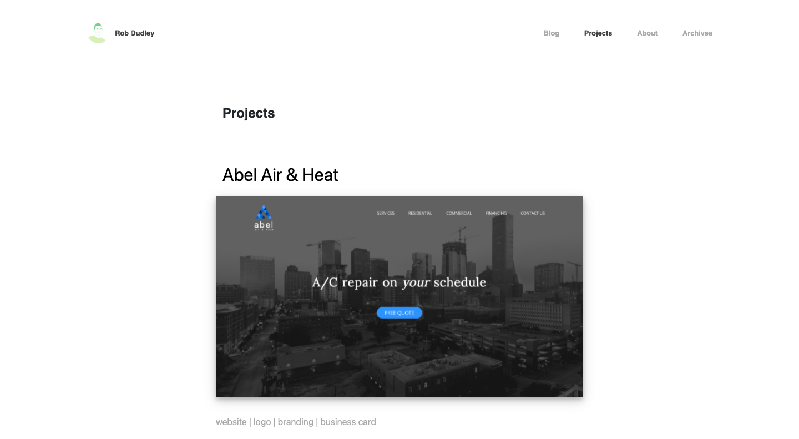

---
# front matter tells Jekyll to process Liquid
layout: default
title:
permalink: /dudley-io
---

  

    

      <h1 class="company-name">dudley.io</h1> 
    

    

      
You might find this hard to believe, but this is the website you're currently on! I started this site to gain more web development experience, practice my writing, and showcase some of the work I've done. I want to be perfectly clear and state that I did not design this website, but I did build it from scratch. The designer of it are the brilliant minds at <a href="https://dribbble.com/tonikstudio" target="_blank" id="tonik">Tonik</a>!

    

  

  

    

      
    

  

  

    

      <h3>Approach</h3> 
    

    

      
I was originally just looking for design inspiration on Dribbble and Behance when I stumbled upon this design from Tonik. I fell in love with it immediately! The design is very clean and minimal with just enough style to feel there is a personality. The original design had blue as the contrast color, so I chose green and designed my profile illustration based on the style from the Tonik’s original illustration. I used Adobe Illustrator to design the illustration and Bootstrap to quickly create the structure and style of the site so typical elements like buttons would have pre-written CSS attributes to look good enough from the start.

    

  

  

    

      
    

  

  

    

      <h3>Result</h3> 
    

    

      
The result is a very simple blog and portfolio site. I decided to use <a href="https://jekyllrb.com/" target=_blank>Jekyll</a> as the framework instead of a full-fledged Content Management System (CMS) because it is extremely light weight and simple to use, as opposed to something like WordPress. I’m still working to make it mobile-friendly, but I just wanted to get the desktop version up and running for potential job recruiters and employers to check out.

    

  

  

    

      
    

  

  

    

      
    

  

