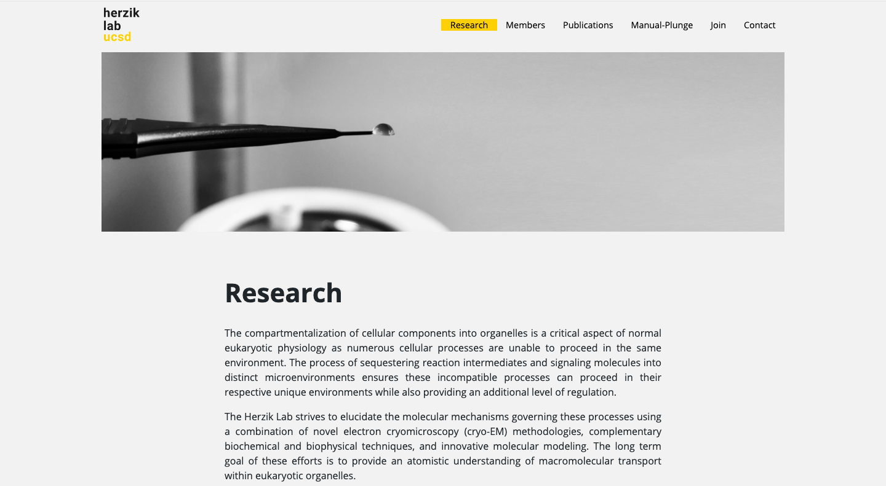
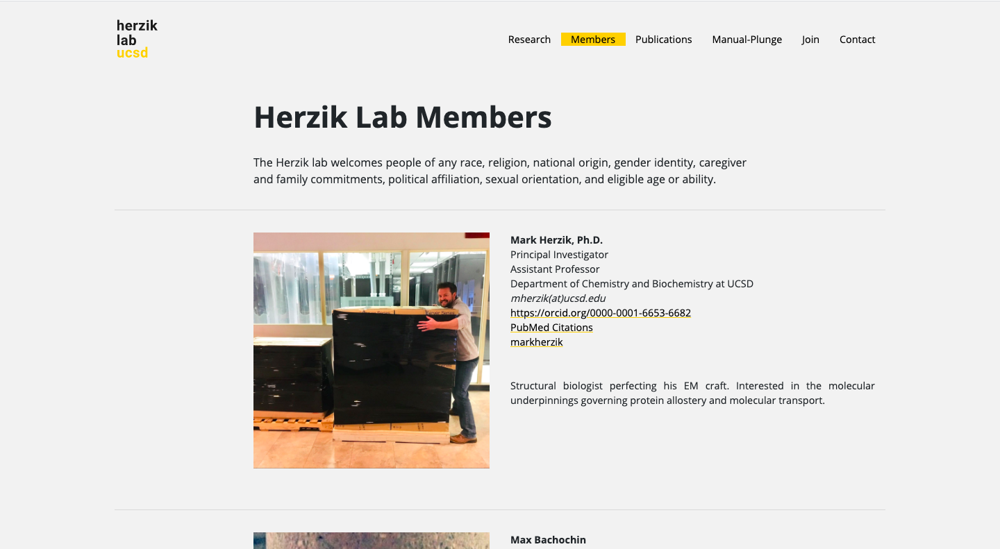
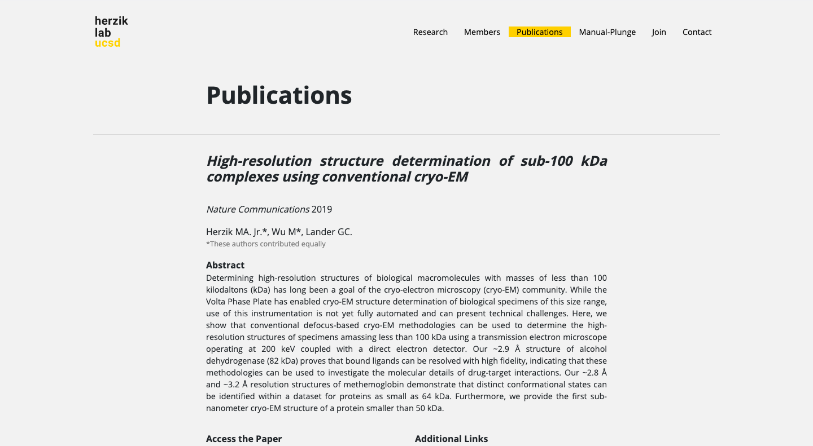

---
# front matter tells Jekyll to process Liquid
layout: default
title:
permalink: /herzik-lab
---

  

    

      <h1 class="company-name">Herzik Lab</h1> 
    

    

      
<a href="https://www.herziklab.com">Herzik Lab</a> is a lab at The University of California, San Diego (UCSD). According to Assistant Professor and the lab's founder, Dr. Mark Herzik, the lab focuses on "elucidating the molecular underpinnings that govern macromolecular transport within eukaryotic cells." I'm not sure what that means but it sure sounds cool! The primary objectives of the site are to showcase the work taking place in the lab, attract funding, and allow potential lab members to learn more and apply for a position in the lab.

    

  

  

    

      
    

  

  

    

      <h3>Approach</h3> 
    

    

      
The client showed me a few websites for other labs that were also built with Bootstrap and Jekyll, so I chose the same tools and a similar simple design.

    

  

  

    

      
    

  

  

    

      <h3>Result</h3> 
    

    

      
I chose the color scheme from UCSD since the lab is based there. I also created a simple logo to provide a brand identity for Dr. Herzik’s lab that includes the UCSD gold color, even though this type of project doesn’t really require a brand identity. The site includes pages for members, publications, manual-plunge process, for people to join, and to contact the lab.

    

  

  

    

      
    

  

  

    

      
    

  

