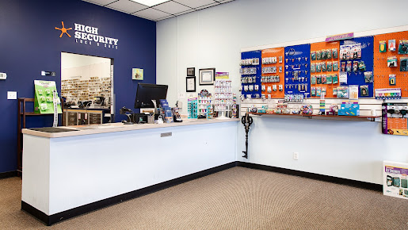
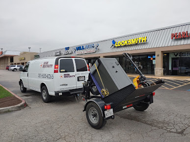

---
# front matter tells Jekyll to process Liquid
layout: default
title:
permalink: /high-security-lock-and-safe
---

  

    

      <h1 class="company-name">High Security Lock & Safe</h1> 
    

    

      
<a href="https://www.highsecuritylockandsafe.com" target=_blank>High Security Lock & Safe</a> is a locksmith service in Pearland, TX that specializes in residential and commercial services as well as safes, doors, and automotive. The client needed a logo that looked professional for the security industry but also allowed them to stand out from the competition.

    

  

  

    

      
    

  

  

    

      <h3>Approach</h3> 
    

    

      
I started with a dark shade of blue for the traditional connections that color has with security in the minds of consumers. I decided to use two different font faces to give the logo more personality, one a Serif and the other Sans-serif.

    

  

  

    

      
    

    

      
    

  

  

    

      <h3>Result</h3> 
    

    

      
The result was a clean and unique logo that the client was very happy with. Apparently, they receive compliments on their logo from customers all the time. And of course, it now adorns the company’s locksmith vans, marketing brochures, and business cards.

    

  

