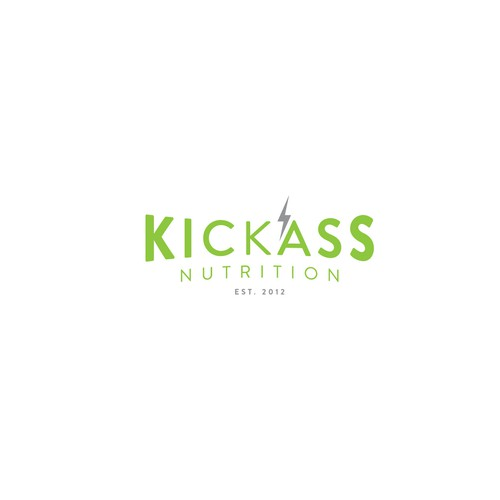

---
# front matter tells Jekyll to process Liquid
layout: default
title:
permalink: /kickass-nutrition
---

  

    

      <h1 class="company-name">Kickass Nutrition</h1> 
    

    

      
Kickass Nutrition, LLC was a company I launched (or rather failed to launch) back in 2012. The original idea was a site for fitness supplements, like bodybuilding.com. However, I realized that I needed to find a more specialized niche if I wanted to gain traction, so I decided to target endurance athletes (runners, cyclists, triathletes, etc.) who were focused on high-quality ingredients. After several roadblocks with web designers and distribution companies, I decided to pivot toward a meal-planning website to create and save meal plans according to an athletes Basal Metabolic Rate (BMR), Total Daily Energy Expenditure (TDEE), and food preferences.

    

  

  

    

      
    

  

  

    

      <h3>Approach</h3> 
    

    

      
I decided to recruit the help of the designers at 99designs.com to come up with a logo. I bought a package that included at least 99 designs guaranteed, but since I was very responsive with the designers and provided feedback, I ultimately got 265 submissions.

    
    The brief was as follows:  

        Values to communicate with your design:
        We want people to feel like we are more of a lifestyle brand rather than just another website with recipes.  We want our logo to embody the interest and attitude of our target audience. 

    
  Stylistic Preferences:
        Here a link(https://www.pinterest.com/robwdudley/logo-inspiration/) to a pinboard on my Pinterest account with some examples of what we’re looking for. We'd like to avoid using silverware and similar themes in the design as we feel that has been overdone. We’d like it to have a healthy and vintage/retro feel to it (think Austin, TX). We’re also looking for versatility as this logo will be used in different ways. It would be great if we could get a light and dark version. But don’t let us stifle your creativity. If you have an idea that only works either light or dark just run with it. 

    
  Colors:
        The colors we like for this are black, white, grays and green (specifically #8dc63f). We’ll keep an open mind. If you’re convinced your design with different colors is great, we’d like to see what you’ve come up with.
        

    

  

  

    

      <h3>Result</h3> 
    

    

      
The result was a plethora of designs, some good some not-so-good. Here were some of the most popular ones from the feedback I received from friends and family:

    

  

  

    

      
    

    

      
    

    

      
    

  

  

    

      
    

    

      
    

    

      
    

  

