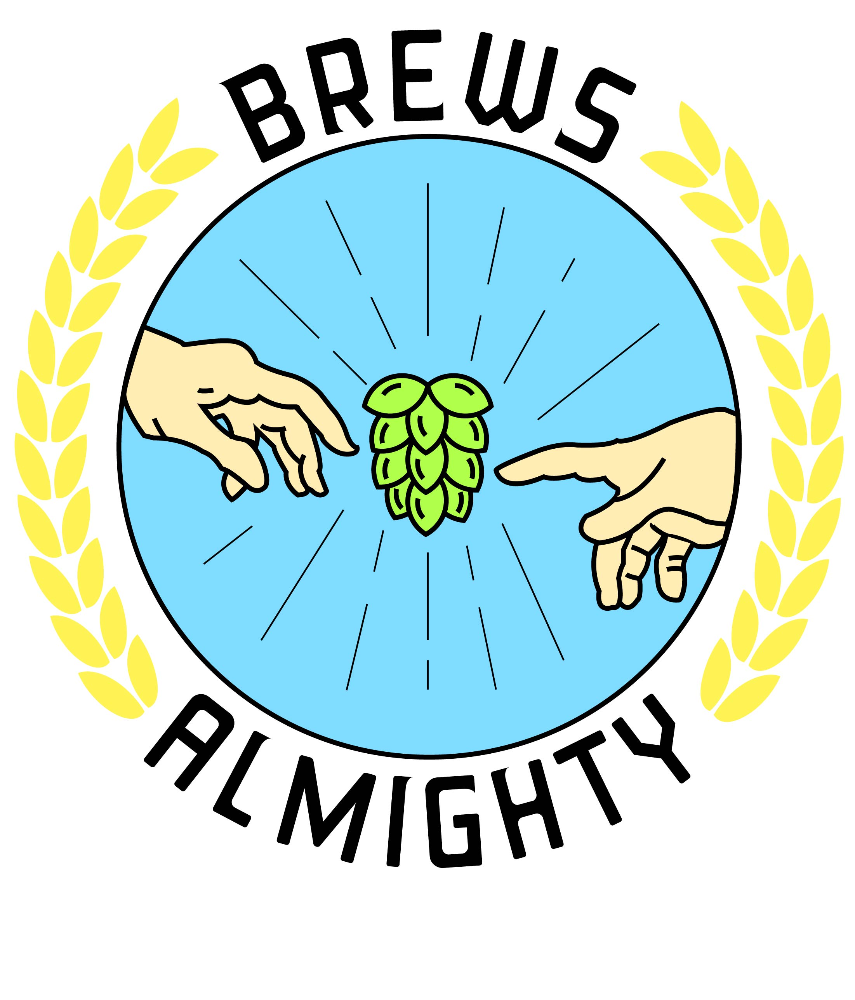

---
# front matter tells Jekyll to process Liquid
layout: default
title:
permalink: /brews-almighty
---

  

    

      <h1 class="company-name">Brews Almighty</h1> 
    

    

      
Brews Almighty is a micro-brewing team for my wife's company, Pros, Inc., who has an awesome annual brewing competition between the employees. The teams brew their best beers and bring them into the office to be judged by other employees and a member from the executive team for a taste-testing competition. I call this logo "The Creation of Hops".

    

  

  

    

      
    

  

  

    

      <h3>Approach</h3> 
    

    

      
I wanted to create a logo with references to beer and God that also had bright colors. As you can see, the logo's focal point is a hop with the hands of God and Adam from Michelangelo's painting of the Sistine Chapel's ceiling, titled "The Creation of Adam". 

    

  

