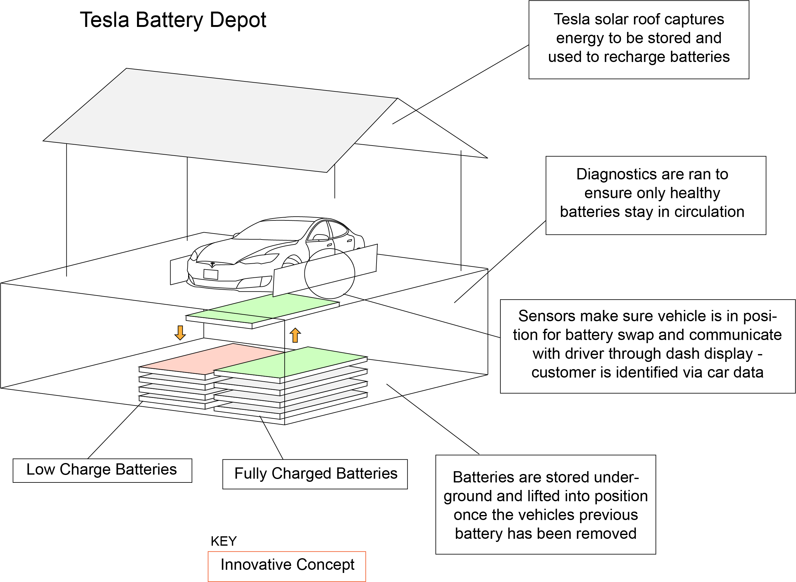

---
# front matter tells Jekyll to process Liquid
layout: default
title:
permalink: /tesla-innovation-project
---

  

    

      <h1 class="company-name">Tesla Innovation Project</h1> 
    

    

      
This was the capstone project for my Corporate Entrepreneurship class.

    

  

  

    

      
    

  

  

    

      <h3>Approach</h3> 
    

    

      
The goal for this project was to create a simple and easy-to-navigate site to recruit lab members, attract funding, and showcase the labs various research projects.

    

  

